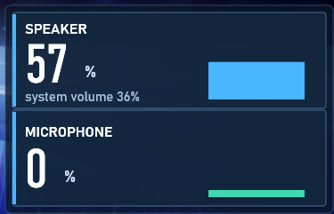

# AudioVolume — Rainmeter 扬声器 / 麦克风 电平监视

两块卡片，实时显示：

- **SPEAKER**：大字 = 当前**实际播放音量**百分比；小字 = `system volume xx%`（系统设置音量）；右侧电平条随播放声音实时起伏
- **MICROPHONE**：大字 = 麦克风**实时输入电平**百分比；右侧电平条随输入电平起伏

深色 / 浅色双主题，左键点 SPEAKER 卡即可切换。



---

## 安装

### 方式一：解压 + 一键安装（推荐，不需要管理员权限）

1. 下载 Release 里的 `AudioVolume-v1.0.0.zip`（或本地执行 `tools\build.ps1` 自己打包）
2. 双击 `install.bat`：把皮肤复制到你的 Rainmeter 皮肤目录并自动加载
3. 若没有自动加载：右键 Rainmeter 托盘图标 → `Skins` → `AudioVolume` → 打开 `AudioVolume.ini`

### 方式二：手动安装

把 `skin/AudioVolume` 整个文件夹复制到：

```
%USERPROFILE%\Documents\Rainmeter\Skins\
```

得到 `Skins\AudioVolume\AudioVolume.ini`，然后在 Rainmeter 里刷新并加载。

### 方式三：.rmskin 包

本仓库**不直接提供** `.rmskin`。该格式是 Rainmeter Skin Packager 生成的**签名包**，
把普通 zip 改名成 `.rmskin` 会被 Rainmeter 拒绝安装。
可以用 Rainmeter 自带工具自己打一个，步骤见 [docs/BUILD.md](docs/BUILD.md) 第 3 节。

---

## 特性

- 电平数据来自 Windows Core Audio（WASAPI）的 `IAudioMeterInformation` 峰值表，
  与系统「声音设置」里那根电平条是**同一个数据源**
- 采集与显示分离：`AudioLevelHelper.exe` 每 80ms 采样一次写入文本文件，皮肤用 Lua 读取
- 限频刷新（默认皮肤 70ms / 电平读取 140ms），CPU 占用低
- 噪声门限：原始电平低于 7% 记为 0，安静时不抖
- 白天 / 黑夜主题，左键点 SPEAKER 卡切换，选择会记住

## 参数

可调项都在 `skin/AudioVolume/AudioVolume.ini` 的 `[Variables]` 区：

| 变量 | 默认值 | 说明 |
| --- | --- | --- |
| `LevelDivider` | 2 | 电平读取间隔 = `Update` × 该值 |
| `ColorAccent` | `72,182,255,255` | 扬声器条颜色 |
| `ColorAccentDim` | `64,216,178,255` | 麦克风条颜色 |
| `ColorCard` | `20,40,64,210` | 卡片底色（含 alpha，半透明） |
| `ColorPanel` | `10,22,38,200` | 外层面板底色 |

噪声门限与回落速度在 `@Resources/bin/levels-out.lua`、`levels-mic.lua` 里
（`GATE` 门限、`FALL_PER_S` 每秒回落量）。改完在皮肤上右键 → `Refresh skin`。

## 性能

| 项目 | 频率 |
| --- | --- |
| 皮肤刷新 | 70ms |
| 读电平文本 | 140ms |
| helper 采样设备 | 80ms（每次只调两次 `GetPeakValue`） |

实测（4 核，放音时条持续动画）约 3 秒内 230ms CPU 时间。
想更省 CPU：把 `AudioVolume.ini` 里的 `Update=70` 调到 100~120。

## 兼容性

- Rainmeter 4.5 及以上（`Shape` 计量需 4.1+，`RunCommand` 插件需 4.3+）
- Windows 10 / 11（Core Audio 接口自 Vista 起可用）
- 需要 .NET Framework 4.x（Windows 10/11 自带）

## 已知限制

1. **皮肤文件里不能写非 ASCII 字符**：Rainmeter 皮肤解析走 ANSI，中文必定乱码，
   因此卡面文字全部是英文。中文只在「测量值」里出现（Unicode 安全）。
2. `.rmskin` 官方包请自行用 Rainmeter 的 Skin Packager 生成（见 docs/BUILD.md）。
3. 只读取**默认播放设备**与**默认录音设备**，跟随系统默认设备切换。
4. 麦克风为只读监测，不提供增益控制。

## 目录结构

```
AudioVolume-Rainmeter/
├─ skin/AudioVolume/            Rainmeter 皮肤（可直接拷进 Skins 目录）
│  ├─ AudioVolume.ini           主文件：变量 + 测量 + 计量
│  └─ @Resources/bin/           采集程序、Lua 脚本、启停脚本
├─ src/AudioLevelHelper.cs      采集程序源码（C# / .NET Framework 4）
├─ .github/workflows/build.yml  CI：编译 + 皮肤自检 + 打包
├─ install.bat                  一键安装（复制到 Skins 目录并通知 Rainmeter 加载）
├─ tools/build.ps1              构建：编译 helper + 打包 zip
├─ tools/probe-coreaudio.ps1    诊断：单独运行采集程序查看原始电平
├─ tools/mdview.ps1             把本仓库的 .md 渲染成网页，方便本地阅读
├─ tools/scan-secrets.ps1       提交前扫描凭据（密钥/token/密码）
├─ docs/BUILD.md                构建与打包说明
├─ docs/NOTES.md                设计说明与踩坑记录
├─ docs/preview.png             README 顶部的预览图
└─ LICENSE                      MIT
```

> `dist/` 是**构建产物**，不提交进仓库（见 `.gitignore`）。
> 安装包通过 GitHub Release 附件发布，或由 Actions 自动构建。
> 本地需要时执行 `powershell -File tools\build.ps1` 即可生成。
>
> 想在本机舒服地读 `docs/` 里的文档，可以执行
> `powershell -File tools\mdview.ps1 docs\NOTES.md`，它会把 Markdown 渲染成网页用浏览器打开。
>
> 提交前建议跑一次 `powershell -File tools\scan-secrets.ps1`，
> 它会扫描密钥、token、密码、私钥等 14 类凭据特征；CI 也已接入这一步。

## 许可证

MIT License，见 [LICENSE](LICENSE)。

Copyright (c) 2026 jiangxiaomengforxingchen

第三方组件：无 —— 采集程序只使用 Windows 自带的 Core Audio COM 接口，未引用任何外部库。

## 作者

jiangxiaomengforxingchen · https://github.com/jiangxiaomengforxingchen
