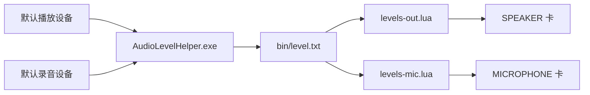

# 设计说明与踩坑记录

## 1. 数据流



- **采集**（`AudioLevelHelper.exe`）：每 80ms 调一次 Core Audio 的
  `IAudioMeterInformation::GetPeakValue`，取默认播放设备与默认录音设备的峰值，
  写入 `bin/level.txt`（UTF-8）：
  ```
  out=<0-100>
  mic=<0-100>
  name_out=<播放设备名>
  name_mic=<录音设备名>
  ```
  内部做指数回落平滑（`--decay`），并用命名互斥体保证只有一个实例在跑。
- **读取**（`levels-out.lua` / `levels-mic.lua`）：各自读文件、噪声门限、
  上升立即跟随 + 按时间回落，`Update()` 返回一个 0-100 的数字。
- **渲染**：两张卡片的 `Shape` 直接内联计算条的几何（见第 3 节第 5 条）。

## 2. 为什么不用 Rainmeter 自带的 AudioLevel 插件

在开发机上 AudioLevel 插件持续报：

```
Failed to create audio client for Windows bug workaround.
Failed to create audio client.
```

输出与输入两路都取不到数值，属于**插件级失败**，皮肤层无法补救，
期间还导致 Rainmeter 崩溃过一次。因此改为自研 WASAPI 采集程序。

## 3. 踩坑记录（都是实测确认过的）

### 1) 皮肤文件里不能出现非 ASCII 字符

Rainmeter 的皮肤解析走 ANSI 路径，皮肤文件里写中文**必定乱码**（UTF-8 BOM 也不行）。
但**测量值**是 Unicode 安全的，所以：

- 卡面文字全部用英文
- 需要中文时，让它作为「测量返回的字符串」出现（本项目设备名就是这么处理的）

### 2) 面板必须写在所有计量之前

Rainmeter **按 section 顺序绘制，后面的盖住前面的**。
本项目外层面板是接近不透明的矩形，一旦写在文件末尾，就会把两张卡片和所有文字全部盖住。
所以 `[PanelBg]` 放在 `[Metadata]` 之后、`[Variables]` 之前。

### 3) `!SetOption` 传 `#变量#` 不会被解析

通过 bang 下发的 Shape 字符串里写 `#ColorCard#`，Rainmeter 不会替换变量，
计量直接变空白。运行时改色必须在 Lua 里解析成字面值 `"r,g,b,a"` 再传。
本项目最终改为**主题只改 ini 变量 + 刷新**，绕开这个问题。

### 4) `Initialize()` 里下发计量级 `!SetOption` 会丢

那一刻计量还没建好。需要在 `OnRefreshAction` 里做。

### 5) 几何公式要直接写进 Shape，不要经过中间 Calc

在 Calc 里写 `Formula=60*Max(Min([MeasureOutPct]/100,1),0)+8`，
再到 Shape 里用 `([S_FillH:])` 引用，会在 Shape 求值上下文里得到 0：
日志实测 `fillH=8`（最小值），而同一个测量单独求值是 20。
**正确做法**：把完整公式内联进 Shape 字符串。

### 6) 两个 Script 计量共用一个 .lua 会串值

Rainmeter 以 `ScriptFile` 路径为键管理 Lua 状态，**同一个文件上的多个 Script 计量共享同一张表**，
`Update()` 每 tick 只执行一次，所以两张卡会拿到同一个数。
解法：两个物理文件（`levels-out.lua` / `levels-mic.lua`），各自独立状态。

### 7) 多值字符串在 Calc 公式里会被截断

曾用「一个 lua 返回 `"out mic"` 两个值」来省一次文件读取，
结果 `Formula=MeasureLevels` 里的 `"0 94"` 被截断成 `0`，两路都变成扬声器的值。
**结论：一个测量只返回一个数**。

### 8) `Win7AudioPlugin` 绑成 `MeasureName` 给的是设备名

- `Text=[MeasureVol]` / `MeasureName=MeasureVol` → 返回**设备名字符串**（如 `扬声器`）
- `[MeasureVol:]` → 返回**数字**（0-100 的音量）

要用它的数值，必须用带冒号的 section variable 形式。

### 9) 本机 `@include` 与 `WebParser file://` 均失效

在开发机上用最小样例验证：

- `@include=#@#x.ini`、相对路径、绝对路径**都不生效**
- `WebParser` 读 `file:///...` 连 `mic=(\d+)` 这种最简正则都匹配不到

因此皮肤写成**单文件**，本地文件读取统一走 **Lua 的 `io.open`**（唯一可靠通道）。

### 10) Lua 文件必须 ASCII 无 BOM

带 BOM 的 `.lua` 会导致：

```
Script: levels.lua:1: unexpected symbol near '?'
```

### 11) 调试截图必须每次重新取窗口坐标

皮肤刷新、`!Move`、主题切换都会改变窗口位置。
用旧坐标截图会截到桌面壁纸，从而误判为「皮肤没渲染」。正确的做法是每次
`GetWindowRect` 拿实时矩形再裁剪。

## 4. 性能优化记录

初版在放音时 3 秒内消耗约 **1078ms** CPU 时间，逐步优化到 **234ms**：

| 优化 | 做法 |
| --- | --- |
| 删掉 26 个装饰性刻度计量 | 它们是最早的虚线底板，每帧都要重新解析 `#ColorTrack#` 变量 |
| 去掉每次同步的 11 条 `!UpdateMeasure` | 改为让计量自己引用测量，Rainmeter 自动求值 |
| 去掉强制 `!Redraw` | 靠正常刷新周期绘制 |
| 合并文件读取 | 每路每 tick 只读一次 |

顺带一提：**不要用「条不动」来评估 CPU** —— 数值恒定时没有重绘，数字会好看得多，
那是假象。

## 5. 主题实现

- `theme.lua`：读 `bin/state.txt` 决定当前主题；点击切换时把配色用 `!WriteKeyValue`
  写回 `AudioVolume.ini` 的 `[Variables]`，然后 `!Refresh`
- 选 ini 驱动的原因：变量由 Rainmeter 自己解析，不需要任何运行时改色，最稳
- 白天 / 黑夜两套配色都定义在 `theme.lua` 的 `PALETTES` 表里（含面板、卡片、文字、条形颜色）

## 6. 文件职责

| 文件 | 职责 |
| --- | --- |
| `AudioVolume.ini` | 变量、测量、两张卡片的所有计量（单文件，无 include） |
| `levels-out.lua` | 读 level.txt → 扬声器通道电平（0-100） |
| `levels-mic.lua` | 读 level.txt → 麦克风通道电平（0-100） |
| `theme.lua` | 主题状态读写与配色写入 |
| `AudioLevelHelper.exe` | WASAPI 峰值采集，写 level.txt |
| `start-helper.vbs` | 静默启动采集程序（皮肤 OnRefreshAction 调用） |
| `stop-helper.bat` | 停止采集程序 |
